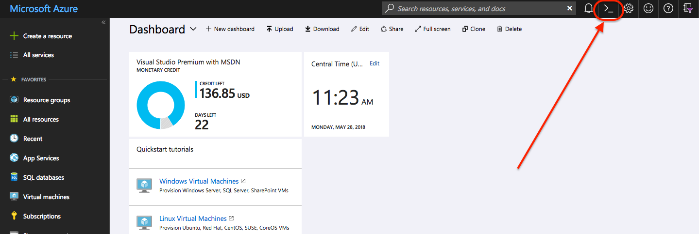

# 00 - Getting Started

## Expected Outcome

In this challenge, you will connect to the [Azure Cloud Shell](https://azure.microsoft.com/en-us/features/cloud-shell/) that will be needed for future challenges.

In this challenge, you will:

- Login to the Azure Portal
- Verify `az` installation
- Verify `terraform` installation
- Create a folder structure to complete challenges

> Note: If you would rather complete the challenges from you local worskstation, detailed instructions can be found [here](local.md).
## How to

### Login to the Azure Portal

Navigate to [https://portal.azure.com](https://portal.azure.com) and login with your Azure Credentials.

This workshop will require that you have access to an Azure Subscription with at least Contributor rights to create resources. If you do not currently have access you can create a trial account by going to [https://azure.microsoft.com/en-us/free](https://azure.microsoft.com/en-us/free) and registering for a 3-month trail.

Signing up for a trial requires:

- A unique Microsoft Live Account that has not registered for a trial for in the past
- A Credit Card, used to verify identity and will not be charged unless you opt-in after the trial is over

> If you are having issues with this access, please alert the instructor ASAP as this will prevent you from completing the challenges.

### Open the Cloud Shell

Located at the top of the page is the button open the Azure Cloud Shell inside the Azure Portal.



> Note: Another option is to use the full screen Azure Cloud Shell at [https://shell.azure.com/](https://shell.azure.com/).

The first time you connect to the Azure Cloud Shell you will be prompted to setup an Azure File Share that you will persist the environment.


Click the "Bash (Linux)" option.

Select the Azure Subscription and click "Create storage":


After a few seconds you should see that your storage account has been created:


> Note: Behind the scenes this is creating a new Resource Group with the name `cloud-shell-storage-eastus` (or which ever region you defaulted to). If you need more information, it can be found [here](https://docs.microsoft.com/en-us/azure/cloud-shell/persisting-shell-storage).

SUCCESS!
You are now logged into the Azure Cloud Shell which uses your portal session to automatically authenticate you with the Azure CLI and Terraform.

### Verify Utilities

In the Cloud Shell type the following commands and verify that the utilities are installed:

`az -v`

<details><summary>View Output</summary>
<p>

```sh
$ az -v
azure-cli (2.0.33)

acr (2.0.25)
acs (2.0.33)
advisor (0.5.1)
ams (0.1.1)
appservice (0.1.33)
backup (1.1.1)
batch (3.2.2)
batchai (0.2.3)
billing (0.1.8)
cdn (0.0.14)
cloud (2.0.13)
cognitiveservices (0.1.13)
command-modules-nspkg (2.0.1)
configure (2.0.15)
consumption (0.3.1)
container (0.1.24)
core (2.0.33)
cosmosdb (0.1.21)
dla (0.1.0)
dls (0.0.21)
dms (0.0.1)
eventgrid (0.1.12)
eventhubs (0.1.3)
extension (0.0.14)
feedback (2.1.1)
find (0.2.9)
interactive (0.3.21)
iot (0.1.20)
keyvault (2.0.22)
lab (0.0.22)
maps (0.1.0)
monitor (0.1.7)
network (2.1.2)
nspkg (3.0.2)
profile (2.0.25)
rdbms (0.2.3)
redis (0.2.13)
reservations (0.1.2)
resource (2.0.29)
role (2.0.24)
servicebus (0.1.2)
servicefabric (0.0.12)
sql (2.0.26)
storage (2.0.33)
vm (2.0.32)

Python location '/opt/az/bin/python3'
Extensions directory '/home/tstraub/.azure/cliextensions'

Python (Linux) 3.6.1 (default, May 18 2018, 04:21:17)
[GCC 5.4.0 20160609]

Legal docs and information: aka.ms/AzureCliLegal
```
</p>
</details>

`terraform -v`

<details><summary>View Output</summary>
<p>

```sh
$ terraform -v
Terraform v0.11.7
```

</p>
</details>

### Verify Subscription

Run the command `az account list -o table`.

```sh
az account list -o table
Name                             CloudName    SubscriptionId                        State    IsDefault
-------------------------------  -----------  ------------------------------------  -------  -----------
Visual Studio Premium with MSDN  AzureCloud   xxxxxxxxxx-xxxx-xxxx-xxxx-xxxxxxxxxx  Enabled  True
Another sub1                     AzureCloud   xxxxxxxxxx-xxxx-xxxx-xxxx-xxxxxxxxxx  Enabled  False
Another sub2                     AzureCloud   xxxxxxxxxx-xxxx-xxxx-xxxx-xxxxxxxxxx  Enabled  False
Another sub3                     AzureCloud   xxxxxxxxxx-xxxx-xxxx-xxxx-xxxxxxxxxx  Enabled  False
```

If you have more than subscription, make sure that subscription is set as default using the subscription name:

```sh
az account set -s 'Visual Studio Premium with MSDN'
```

### Create Challenge Scaffolding

Running an `ls` command will list all the files and directories:

```sh
$ ls
clouddrive
```

Here we can see a folder called `clouddrive` which persists all of our files.

Change directory into that folder now `cd clouddrive`.

> Note: Be sure to always change into this directory or subdirectory if you happen to close your Azure Cloud Shell instance.

To make things easy for the challenges, let's create a folder structure to hold the terraform configuration we will create.

Run the following in the azure cloud shell, this will simply create a folder structure for you to place your Terraform configuration:

```sh
mkdir AzureWorkChallenges && cd AzureWorkChallenges && mkdir challenge01 && mkdir challenge02 && mkdir challenge03 && mkdir challenge04 && mkdir challenge05 && mkdir challenge06 && mkdir challenge07
```

What you should end up with is a structure like this:

```sh
AzureWorkChallenges
|- challenge01
|- challenge02
|- challenge03
|- challenge04
|- challenge05
|- challenge06
|- challenge07
```
