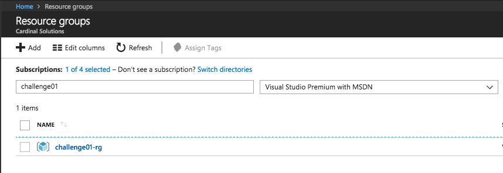
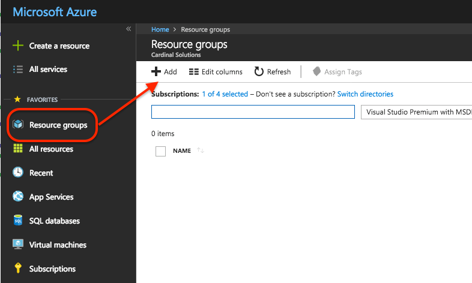
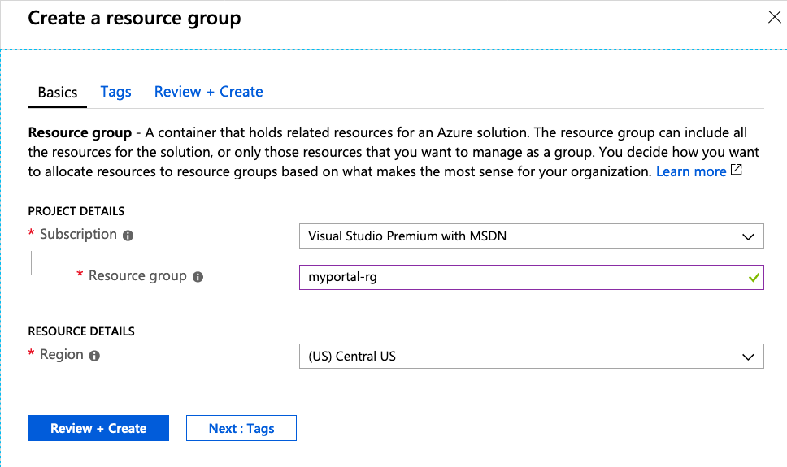
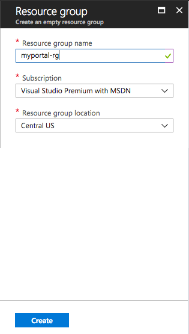
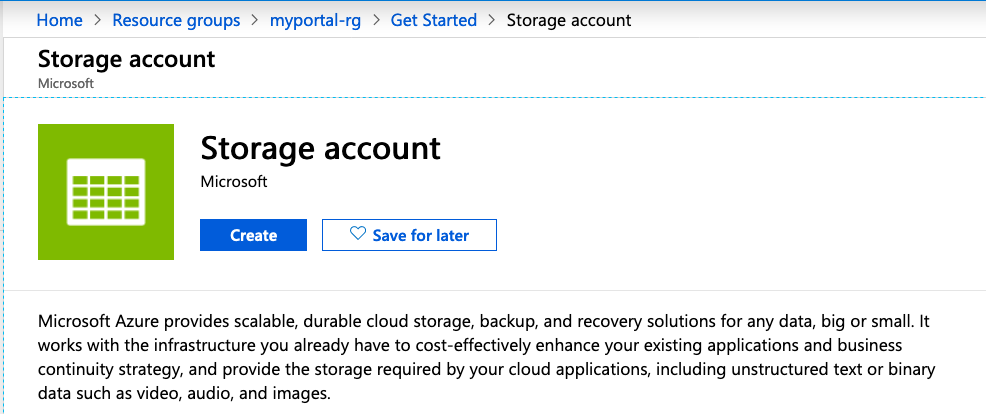
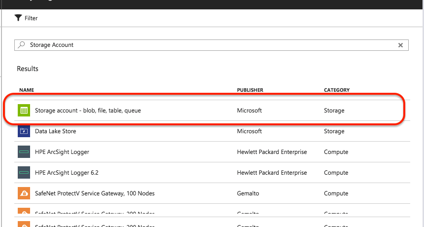
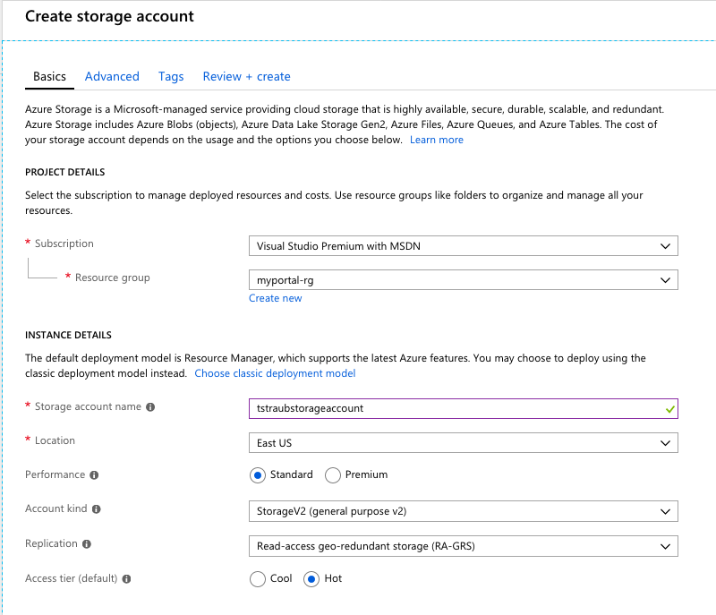
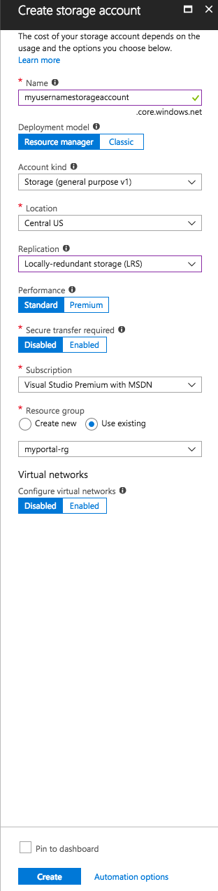

# 01 - Connection To Azure

## Expected Outcome

In this challenge, you will use Terraform from the Azure Cloud Shell to create simple infrastructure in your Azure Subscription.

In this challenge, you will:

- Initialize Terraform
- Run a `plan` on simple a simple resource
- Run an `apply` to create Azure infrastructure
- Run a `destroy` to remove Azure infrastructure

## How To

### Create Terraform Configuration

From the Cloud Shell, change directory into a folder specific to this challenge. If you created the scaffolding in Challenge 00, then then you can use the command `cd ~/AzureWorkChallenges/challenge01/`.

Create a file named `main.tf` and add a single Resource Group resource.

```hcl
resource "azurerm_resource_group" "test" {
  name     = "challenge01-rg"
  location = "eastus"
}
```

This will create a simple Resource Group and allow you to walk through the Terraform Workflow.

### Run the Terraform Workflow

`terraform init`
<details><summary>View Output</summary>
<p>

```sh
$ terraform init

Initializing provider plugins...

Terraform has been successfully initialized!

You may now begin working with Terraform. Try running "terraform plan" to see
any changes that are required for your infrastructure. All Terraform commands
should now work.

If you ever set or change modules or backend configuration for Terraform,
rerun this command to reinitialize your working directory. If you forget, other
commands will detect it and remind you to do so if necessary.
```

</p>
</details>

---
`terraform plan`

<details><summary>View Output</summary>
<p>

```sh
$ terraform plan
Refreshing Terraform state in-memory prior to plan...
The refreshed state will be used to calculate this plan, but will not be
persisted to local or remote state storage.


------------------------------------------------------------------------

An execution plan has been generated and is shown below.
Resource actions are indicated with the following symbols:
  + create

Terraform will perform the following actions:

  + azurerm_resource_group.main
      id:       <computed>
      location: "eastus"
      name:     "challenge01-rg"
      tags.%:   <computed>


Plan: 1 to add, 0 to change, 0 to destroy.

------------------------------------------------------------------------

Note: You didn't specify an "-out" parameter to save this plan, so Terraform
can't guarantee that exactly these actions will be performed if
"terraform apply" is subsequently run.
```

</p>
</details>

---
`terraform apply`
<details><summary>View Output</summary>
<p>

```sh
$ terraform apply

An execution plan has been generated and is shown below.
Resource actions are indicated with the following symbols:
  + create

Terraform will perform the following actions:

  + azurerm_resource_group.main
      id:       <computed>
      location: "eastus"
      name:     "challenge01-rg"
      tags.%:   <computed>


Plan: 1 to add, 0 to change, 0 to destroy.

Do you want to perform these actions?
  Terraform will perform the actions described above.
  Only 'yes' will be accepted to approve.

  Enter a value: yes

azurerm_resource_group.main: Creating...
  location: "" => "eastus"
  name:     "" => "challenge01-rg"
  tags.%:   "" => "<computed>"
azurerm_resource_group.main: Creation complete after 1s (ID: /subscriptions/.../resourceGroups/challenge01-rg)

Apply complete! Resources: 1 added, 0 changed, 0 destroyed.
```
</p>
</details>

---

Congrats, you just created your first Azure resource using Terraform!

### Verify in the Azure Portal

Head over to the [Azure Portal](https://portal.azure.com/)

View all Resource Groups and you should see the recently created Resource Group.


### Scale Resources

Now add a new Resource Group resource that scales with a `count` parameter.

> Note: This is ADDING another `resource` block in addition to the one you have already created.

```hcl
resource "azurerm_resource_group" "count" {
  name     = "challenge01-rg-${count.index}"
  location = "eastus"
  count    = 2
}
```

Run another `terraform plan` then `terraform apply` and validate the resource groups have been created.

---

## How To - Part 2 (Import Resources)

### Create Infrastructure in the Portal

Navigate to the Azure Portal and click on the "Resource groups" item on the left side and then click  "+ Add":



In the Resource Group create blade give the resource group the name "myportal-rg" and click "Review + Create" -> "Create":


<!--  -->

Once the Resource Group is created, navigate to it.

Find the "+ Add" button and click it:


Search for "Storage Account" and click the first item and then click "Create" :


<!--  -->


In the Storage Account create blade, fill out the following:

- Subscription = Use the current subscription
- Resource Group = Use Existing and select "myportal-rg"
- Name = Must be a unique name, there will be a green checkmark that shows up in the text box if your name is available. Example "<YOURUSERNAME>storageaccount"
- Location = East US
- Performance = Standard
- Account Kind = Storage V2
- Replication = LRS
- Access Tier = Hot


<!--  -->

Click "Review + Create" -> "Create".

At this point we have a Resource Group and a Storage Account and are ready to import this into Terraform.


### Create Terraform Configuration

Your Azure Cloud Shell should still be in the folder for this challenge with a single `main.tf` file.
We will now add `resource` blocks to represent the infrastructure we are about to import.

We have two resources we need to import into our Terraform Configuration, to do this we need to do two things:

1. Create the base Terraform configuration for both resources.
2. Run `terraform import` to bring the infrastructure into our state file.

To create the base configuration place the following code into the `main.tf` file.

```hcl
resource "azurerm_resource_group" "import" {
  name     = "myportal-rg"
  location = "eastus"
}

resource "azurerm_storage_account" "import" {
  name                      = "myusernamestorageaccount"
  resource_group_name       = "${azurerm_resource_group.import.name}"
  location                  = "eastus"
  account_kind              = "StorageV2"
  account_tier              = "Standard"
  account_replication_type  = "LRS"
  enable_https_traffic_only = true
}
```

`terraform plan`

Shows 2 to add

```sh
Terraform will perform the following actions:

  + azurerm_resource_group.main
      id:                               <computed>
      location:                         "centralus"
      name:                             "myportal-rg"
      tags.%:                           <computed>

  + azurerm_storage_account.main
      id:                               <computed>
      access_tier:                      <computed>
      account_encryption_source:        "Microsoft.Storage"
      account_kind:                     "Storage"
      account_replication_type:         "LRS"
      account_tier:                     "Standard"
      enable_blob_encryption:           <computed>
      enable_file_encryption:           <computed>
      location:                         "centralus"
      name:                             "myusernamestorageaccount"
      primary_access_key:               <computed>
      primary_blob_connection_string:   <computed>
      primary_blob_endpoint:            <computed>
      primary_connection_string:        <computed>
      primary_file_endpoint:            <computed>
      primary_location:                 <computed>
      primary_queue_endpoint:           <computed>
      primary_table_endpoint:           <computed>
      resource_group_name:              "myportal-rg"
      secondary_access_key:             <computed>
      secondary_blob_connection_string: <computed>
      secondary_blob_endpoint:          <computed>
      secondary_connection_string:      <computed>
      secondary_location:               <computed>
      secondary_queue_endpoint:         <computed>
      secondary_table_endpoint:         <computed>
      tags.%:                           <computed>


Plan: 2 to add, 0 to change, 0 to destroy.
```

> CAUTION: This is not what we want!

### Import the Resource Group

We need two values to run the `terraform import` command:

1. Resource Address from our configuration
1. Azure Resource ID

The Resource Address is simple enough, based on the configuration above it is simply "azurerm_resource_group.main".

The Azure Resource ID can be retrieved using the Azure CLI by running `az group show -g myportal-rg --query id`. The value should look something like "/subscriptions/xxxxxx-xxxx-xxxx-xxxx-xxxxxxxxxxxx/resourceGroups/myportal-rg".

Now run the import command:

```sh
$ terraform import azurerm_resource_group.import /subscriptions/xxxxxx-xxxx-xxxx-xxxx-xxxxxxxxxxxx/resourceGroups/myportal-rg

Import successful!

The resources that were imported are shown above. These resources are now in
your Terraform state and will henceforth be managed by Terraform.
```

### Import the Storage Account

The process here is the same.

The Resource Address is simple enough, based on the configuration above it is simply "azurerm_storage_account.main".

The Azure Resource ID can be retrieved using the Azure CLI by running `az storage account show -g myportal-rg -n myusernamestorageaccount --query id`. The value should look something like "/subscriptions/xxxxxx-xxxx-xxxx-xxxx-xxxxxxxxxxxx/resourceGroups/myportal-rg/providers/Microsoft.Storage/storageAccounts/myusernamestorageaccount".

```sh
$ terraform import azurerm_storage_account.import /subscriptions/xxxxxx-xxxx-xxxx-xxxx-xxxxxxxxxxxx/resourceGroups/myportal-rg/providers/Microsoft.Storage/storageAccounts/myusernamestorageaccount

Import successful!

The resources that were imported are shown above. These resources are now in
your Terraform state and will henceforth be managed by Terraform.
```

### Verify Plan

Run a `terraform plan`, you should see no changes:

```sh
$ terraform plan

...

No changes. Infrastructure is up-to-date.

This means that Terraform did not detect any differences between your
configuration and real physical resources that exist. As a result, no
actions need to be performed.
```

### Make a Change

Add the following tag configuration to both the Resource Group and the Storage Account:

```hcl
resource "azurerm_resource_group" "import" {
  ...
  tags {
    terraform = "true"
  }
}

resource "azurerm_storage_account" "import" {
  ...
  tags {
    terraform = "true"
  }
}
```

Run a plan, we should see two changes.

```sh
  ~ azurerm_resource_group.import
      tags.%:         "0" => "1"
      tags.terraform: "" => "true"

  ~ azurerm_storage_account.import
      tags.%:         "0" => "1"
      tags.terraform: "" => "true"


Plan: 0 to add, 2 to change, 0 to destroy.
```

Run `terraform apply`.

SUCCESS! You have now brought existing infrastructure into Terraform.

### Cleanup

When you are done, destroy the infrastructure, you no longer need it.

```sh
$ terraform destroy
azurerm_resource_group.main: Refreshing state... (ID: /subscriptions/.../resourceGroups/challenge01-rg)
azurerm_resource_group.import: Refreshing state... (ID: /subscriptions/.../resourceGroups/myportal-rg)
azurerm_resource_group.count[0]: Refreshing state... (ID: /subscriptions/.../resourceGroups/challenge01-rg-0)
azurerm_resource_group.count[1]: Refreshing state... (ID: /subscriptions/.../resourceGroups/challenge01-rg-1)
azurerm_storage_account.import: Refreshing state... (ID: /subscriptions/.../storageAccounts/myusernamestorageaccount)

An execution plan has been generated and is shown below.
Resource actions are indicated with the following symbols:
  - destroy

Terraform will perform the following actions:

  - azurerm_resource_group.count[0]

  - azurerm_resource_group.count[1]

  - azurerm_resource_group.import

  - azurerm_resource_group.main

  - azurerm_storage_account.import


Plan: 0 to add, 0 to change, 5 to destroy.

Do you really want to destroy all resources?
  Terraform will destroy all your managed infrastructure, as shown above.
  There is no undo. Only 'yes' will be accepted to confirm.clear

  Enter a value: yes

azurerm_resource_group.count[1]: Destroying... (ID: /subscriptions/.../resourceGroups/challenge01-rg-1)
azurerm_resource_group.main: Destroying... (ID: /subscriptions/.../resourceGroups/challenge01-rg)
azurerm_storage_account.import: Destroying... (ID: /subscriptions/.../storageAccounts/myusernamestorageaccount)
azurerm_resource_group.count[0]: Destroying... (ID: /subscriptions/.../resourceGroups/challenge01-rg-0)
azurerm_storage_account.import: Destruction complete after 1s
azurerm_resource_group.import: Destroying... (ID: /subscriptions/.../resourceGroups/myportal-rg)
azurerm_resource_group.main: Still destroying... (ID: /subscriptions/.../resourceGroups/challenge01-rg, 10s elapsed)
azurerm_resource_group.count.1: Still destroying... (ID: /subscriptions/.../resourceGroups/challenge01-rg-1, 10s elapsed)
azurerm_resource_group.count.0: Still destroying... (ID: /subscriptions/.../resourceGroups/challenge01-rg-0, 10s elapsed)
azurerm_resource_group.import: Still destroying... (ID: /subscriptions/.../resourceGroups/myportal-rg, 10s elapsed)
azurerm_resource_group.main: Still destroying... (ID: /subscriptions/.../resourceGroups/challenge01-rg, 20s elapsed)
azurerm_resource_group.count.1: Still destroying... (ID: /subscriptions/.../resourceGroups/challenge01-rg-1, 20s elapsed)
azurerm_resource_group.count.0: Still destroying... (ID: /subscriptions/.../resourceGroups/challenge01-rg-0, 20s elapsed)
azurerm_resource_group.import: Still destroying... (ID: /subscriptions/.../resourceGroups/myportal-rg, 20s elapsed)
azurerm_resource_group.main: Still destroying... (ID: /subscriptions/.../resourceGroups/challenge01-rg, 30s elapsed)
azurerm_resource_group.count.1: Still destroying... (ID: /subscriptions/.../resourceGroups/challenge01-rg-1, 30s elapsed)
azurerm_resource_group.count.0: Still destroying... (ID: /subscriptions/.../resourceGroups/challenge01-rg-0, 30s elapsed)
azurerm_resource_group.import: Still destroying... (ID: /subscriptions/.../resourceGroups/myportal-rg, 30s elapsed)
azurerm_resource_group.main: Still destroying... (ID: /subscriptions/.../resourceGroups/challenge01-rg, 40s elapsed)
azurerm_resource_group.count.1: Still destroying... (ID: /subscriptions/.../resourceGroups/challenge01-rg-1, 40s elapsed)
azurerm_resource_group.count.0: Still destroying... (ID: /subscriptions/.../resourceGroups/challenge01-rg-0, 40s elapsed)
azurerm_resource_group.import: Still destroying... (ID: /subscriptions/.../resourceGroups/myportal-rg, 40s elapsed)
azurerm_resource_group.count[0]: Destruction complete after 45s
azurerm_resource_group.count[1]: Destruction complete after 45s
azurerm_resource_group.main: Destruction complete after 45s
azurerm_resource_group.import: Destruction complete after 46s

Destroy complete! Resources: 5 destroyed.
```

Because the infrastructure is now managed by Terraform, we can destroy just like before.

Run a `terraform destroy` and follow the prompts to remove the infrastructure.

## Advanced areas to explore

1. Play around with adjusting the `count` and `name` parameters, then running `plan` and `apply`.
2. Run the `plan` command with the `-out` option and apply that output.
3. Add tags to each resource.

## Resources

- [Terraform Count](https://www.terraform.io/docs/configuration/interpolation.html#count-information)
- [Terraform Import](https://www.terraform.io/docs/commands/import.html)
