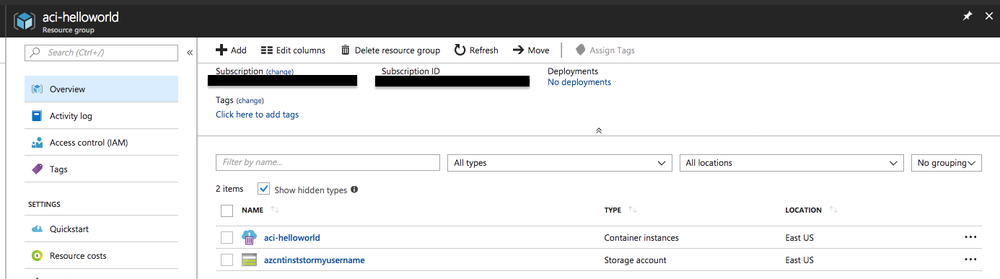
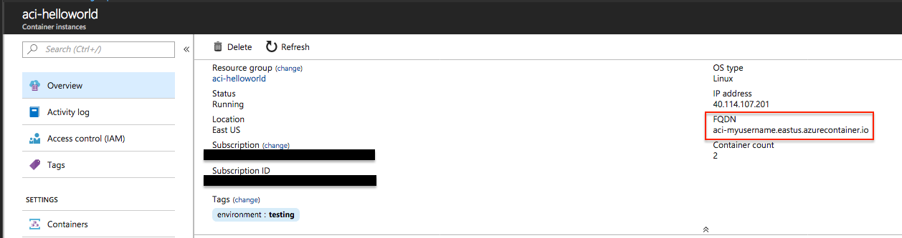
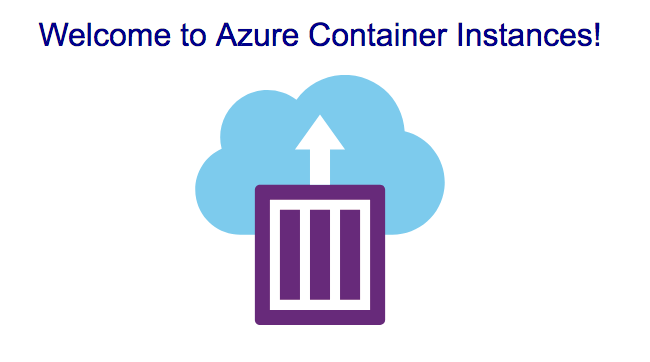
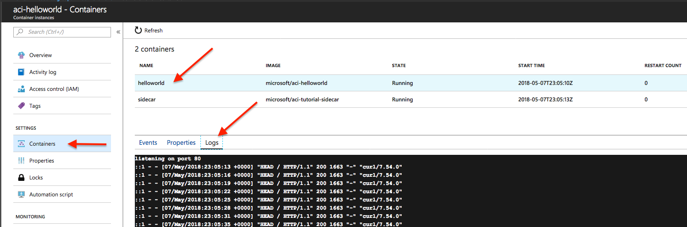
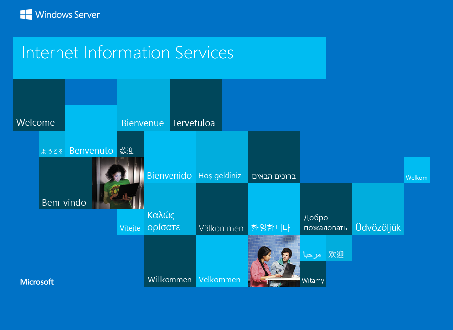

# 02 - Azure Container Instance

## Expected Outcome

In this challenge, you will learn how to deploy a PaaS solution using Terraform.

There are two docker containers that will be deployed:

- [Hello World](https://github.com/Azure-Samples/aci-helloworld)
    - A simple NodeJS web application that displays a message.
    - Hosted on [Dockerhub](https://hub.docker.com/r/microsoft/aci-helloworld/)
- [Sidecar](https://github.com/Azure-Samples/aci-tutorial-sidecar) 
    - A simple watchdog script that calls the Hello World application every 3 seconds.
    - Hosted on [Dockerhub](https://hub.docker.com/r/microsoft/aci-tutorial-sidecar/)

## How to

### Create Terraform Configuration

Create a new file called `main.tf` with the following contents:

```hcl
variable "username" {
  default = "myusername"
}

resource "azurerm_resource_group" "main" {
  name     = "aci-helloworld"
  location = "eastus"
}

resource "azurerm_storage_account" "main" {
  name                     = "azcntinststor${var.username}"
  resource_group_name      = "${azurerm_resource_group.main.name}"
  location                 = "${azurerm_resource_group.main.location}"
  account_tier             = "Standard"
  account_replication_type = "LRS"
}

resource "azurerm_storage_share" "main" {
  name                 = "aci-test-share"
  resource_group_name  = "${azurerm_resource_group.main.name}"
  storage_account_name = "${azurerm_storage_account.main.name}"
  quota                = 1
}

resource "azurerm_container_group" "main" {
  name                = "aci-helloworld"
  location            = "${azurerm_resource_group.main.location}"
  resource_group_name = "${azurerm_resource_group.main.name}"
  ip_address_type     = "public"
  dns_name_label      = "aci-${var.username}"
  os_type             = "linux"

  container {
    name   = "helloworld"
    image  = "microsoft/aci-helloworld"
    cpu    = "0.5"
    memory = "1.5"
    port   = "80"

    environment_variables {
      "NODE_ENV" = "testing"
    }

    volume {
      name       = "logs"
      mount_path = "/aci/logs"
      read_only  = false
      share_name = "${azurerm_storage_share.main.name}"

      storage_account_name = "${azurerm_storage_account.main.name}"
      storage_account_key  = "${azurerm_storage_account.main.primary_access_key}"
    }
  }

  container {
    name   = "sidecar"
    image  = "microsoft/aci-tutorial-sidecar"
    cpu    = "0.5"
    memory = "1.5"
  }

  tags {
    environment = "testing"
  }
}
```

> Be sure to update the `username` variable that is a unique name to you, and that it is less than 6 characters. This is used to build the storage account name and the public DNS name for the Container Instance and therefor must be unique.

### Terraform Init and Plan

Running an `init` should look something like this:

```sh
terraform init

...

Terraform has been successfully initialized!
```

Running a `plan` should look something like this:

```sh
terraform plan
Terraform will perform the following actions:

  + azurerm_container_group.main
      name:                                       "aci-helloworld"
      ...

  + azurerm_resource_group.main
      name:                                       "aci-helloworld"
      ...

  + azurerm_storage_account.main
      name:                                       "azcntinststormyusername"
      ...

  + azurerm_storage_share.main
      name:                                       "aci-test-share"
      ...


Plan: 4 to add, 0 to change, 0 to destroy.
```

### Terraform Apply

Running an `apply` should look just like a plan except you are prompted for approval to apply.
Type 'yes' and let Terraform build your infrastructure.

### Navigate to the Azure Portal

Open a browser and navigate to the the [Azure Portal](https://portal.azure.com) and you should see your resource group and its resources.


### Find the Full Qualified Domain Name

Click into the Azure Container Instance and take note of its FQDN.


### Navigate to the Web App

Navigate to that URL and you should see the following:


### View the Logs
Back in the Azure Portal, navigate to the Azure Container Instance and view its logs by clicking on the "Containers" tab:


Wait a few seconds and refresh the logs, you should see more requests due to the sidecar container.

## A Step Further (optional)

Azure Container Instances also support windows containers!

### Create a Windows Container

Create another resource by adding the following to your existing `main.tf` file:

```hcl
resource "azurerm_container_group" "windows" {
  name                = "aci-iis"
  location            = "${azurerm_resource_group.main.location}"
  resource_group_name = "${azurerm_resource_group.main.name}"
  ip_address_type     = "public"
  dns_name_label      = "aci-iis-${var.username}"
  os_type             = "windows"

  container {
    name   = "dotnetsample"
    image  = "microsoft/iis"
    cpu    = "0.5"
    memory = "1.5"
    port   = "80"
  }

  tags {
    environment = "testing"
  }
}
```

### Run Terraform Workflow

Running an `init`, `plan`, and `apply` should yield another Container Instance.

Navigating back to the Azure Portal to get the FQDN and following that URL should get you the very familiar IIS default sites page:


## Cleanup

Run a `terraform destroy` when you are done exploring.

## Advanced areas to explore

1. What do you think will happen if you try to combine the Azure Container Instances above (Linux and Windows) into one?
1. Replicate the Terraform above using a single Azure ClI command. Which is easier?

## Resources

- [Azurerm Container Group Docs](https://www.terraform.io/docs/providers/azurerm/r/container_group.html)
- [Azure Container Instances](https://azure.microsoft.com/en-us/services/container-instances)
