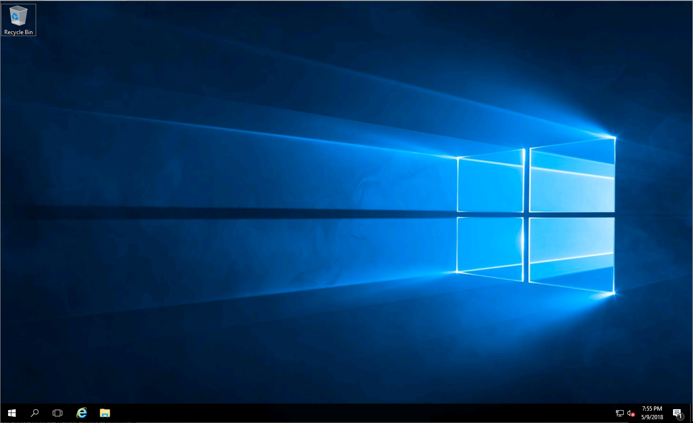

# 03 - Azure Virtual Machine

## Expected Outcome

In this challenge, you will create a Azure Virtual Machine running Windows Server.

You will gradually add Terraform configuration to build all the resources needed to be able to login to the Azure Virtual Machine.

The resources you will use in this challenge:

- Resource Group
- Virtual Network
- Subnet
- Network Interface
- Virtual Machine
- Public IP Address

## How to

### Create the base Terraform Configuration

We will start with a few of the basic resources needed.

From the Cloud Shell, change directory into a folder specific to this challenge. If you created the scaffolding in Challenge 00, then then you can use the command `cd ~/AzureWorkChallenges/challenge03/`.

Create a `main.tf` file to hold our configuration.

### Create Variables

Create a few variables that will help keep our code clean:

```hcl
variable "name" {
  default = "challenge03"
}

variable "location" {
  default = "eastus"
}
```

### Create a Resource Group

Now create a Resource Group to contain all of our infrastructure using the variables to interpolate the parameters:

```hcl
resource "azurerm_resource_group" "main" {
  name     = "${var.name}-rg"
  location = "${var.location}"
}
```

### Create Virtual Networking

In order to create an Azure Virtual Machine we need to create a network in which to place it.

Create a Virtual Network and Subnet using a basic CIDR block to allocate an IP block:

```hcl
resource "azurerm_virtual_network" "main" {
  name                = "${var.name}-vnet"
  address_space       = ["10.0.0.0/16"]
  location            = "${azurerm_resource_group.main.location}"
  resource_group_name = "${azurerm_resource_group.main.name}"
}

resource "azurerm_subnet" "main" {
  name                 = "${var.name}-subnet"
  resource_group_name  = "${azurerm_resource_group.main.name}"
  virtual_network_name = "${azurerm_virtual_network.main.name}"
  address_prefix       = "10.0.1.0/24"
}
```

> Notice that we use the available metadata from the `azurerm_resource_group.main` resource to populate the parameters of other resources.

### Run Terraform Workflow

Run `terraform init` since this is the first time we are running Terraform from this directory.

Run `terraform plan` where you should see the plan of two new resources, namely the Resource Group and the Virtual Network.

<details><summary>View Output</summary>
<p>

```sh
$ terraform plan
Refreshing Terraform state in-memory prior to plan...
The refreshed state will be used to calculate this plan, but will not be
persisted to local or remote state storage.


------------------------------------------------------------------------

An execution plan has been generated and is shown below.
Resource actions are indicated with the following symbols:
  + create

Terraform will perform the following actions:

  + azurerm_resource_group.main
      id:                  <computed>
      location:            "eastus"
      name:                "challenge03-rg"
      tags.%:              <computed>

  + azurerm_subnet.main
      id:                   <computed>
      address_prefix:       "10.0.1.0/24"
      ip_configurations.#:  <computed>
      name:                 "challenge03-subnet"
      resource_group_name:  "challenge03-rg"
      virtual_network_name: "challenge03-vnet"

  + azurerm_virtual_network.main
      id:                   <computed>
      address_space.#:      "1"
      address_space.0:      "10.0.0.0/16"
      location:             "eastus"
      name:                 "challenge03-vnet"
      resource_group_name:  "challenge03-rg"
      subnet.#:             <computed>
      tags.%:               <computed>


Plan: 3 to add, 0 to change, 0 to destroy.

------------------------------------------------------------------------

Note: You didn't specify an "-out" parameter to save this plan, so Terraform
can't guarantee that exactly these actions will be performed if
"terraform apply" is subsequently run.
```

</p>
</details>

If your plan looks good, go ahead and run `terraform apply` and type "yes" to confirm you want to apply.
When it completes you should see:

```sh
Apply complete! Resources: 3 added, 0 changed, 0 destroyed.
```

### Create the Azure Virtual Machine

Now that we have base networking in place, we will add a Network Interface and Virtual Machine.
We will create a VM with an Azure Marketplace Image for Windows Server 2016 Datacenter.

Create the Network Interface resource:

```hcl
resource "azurerm_network_interface" "main" {
  name                = "${var.name}-nic"
  location            = "${azurerm_resource_group.main.location}"
  resource_group_name = "${azurerm_resource_group.main.name}"

  ip_configuration {
    name                          = "config1"
    subnet_id                     = "${azurerm_subnet.main.id}"
    private_ip_address_allocation = "dynamic"
  }
}
```

Create the Virtual Machine resource:

```hcl
resource "azurerm_virtual_machine" "main" {
  name                  = "${var.name}-vm"
  location              = "${azurerm_resource_group.main.location}"
  resource_group_name   = "${azurerm_resource_group.main.name}"
  network_interface_ids = ["${azurerm_network_interface.main.id}"]
  vm_size               = "Standard_A2_v2"

  storage_image_reference {
    publisher = "MicrosoftWindowsServer"
    offer     = "WindowsServer"
    sku       = "2016-Datacenter"
    version   = "latest"
  }

  storage_os_disk {
    name              = "${var.name}vm-osdisk"
    caching           = "ReadWrite"
    create_option     = "FromImage"
    managed_disk_type = "Standard_LRS"
  }

  os_profile {
    computer_name  = "${var.name}vm"
    admin_username = "testadmin"
    admin_password = "Password1234!"
  }

  os_profile_windows_config {}
}
```

Take note of the OS image:

```hcl
  storage_image_reference {
    publisher = "MicrosoftWindowsServer"
    offer     = "WindowsServer"
    sku       = "2016-Datacenter"
    version   = "latest"
  }
```

Run a plan and apply to create both these resources.

### Add a Public IP

At this point you should have a running Virtual Machine in Azure running Windows Server, however you have no way to access it. To do this we must do two things, create the Public IP Resource and configure the Network Interface to use it.

Create a Public IP Address that will assign an IP address:

```hcl
resource "azurerm_public_ip" "main" {
  name                         = "${var.name}-pubip"
  location                     = "${azurerm_resource_group.main.location}"
  resource_group_name          = "${azurerm_resource_group.main.name}"
  public_ip_address_allocation = "static"
}
```

Update the IP Configuration parameter of the Network Interface to attach the Public IP:

```hcl
resource "azurerm_network_interface" "main" {
  ...

  ip_configuration {
    ...
    public_ip_address_id          = "${azurerm_public_ip.main.id}"
  }
}
```

### Terraform Plan

Running `terraform plan` should contain something like the following:

```sh
  ~ azurerm_network_interface.main
      ip_configuration.0.public_ip_address_id: "" => "${azurerm_public_ip.main.id}"

  + azurerm_public_ip.main
      id:                                      <computed>
      fqdn:                                    <computed>
      ip_address:                              <computed>
      location:                                "eastus"
      name:                                    "challenge03-pubip"
      public_ip_address_allocation:            "static"
      resource_group_name:                     "challenge03-rg"
      sku:                                     "Basic"
      tags.%:                                  <computed>


Plan: 1 to add, 1 to change, 0 to destroy.
```

> Notice that there is a new resource being added and one being updated.

Run `terraform apply` to apply the changes.

### Outputs

You now have all the infrastructure in place and can now Remote Desktop into the Windows Server VM we just stood up.

But wait, the Public IP was dynamically created, how do I access it?

You could check the value in the Azure Portal, however let's instead add an output to get that information.

Add the following output:

```hcl
output "private-ip" {
  value       = "${azurerm_network_interface.main.private_ip_address}"
  description = "Private IP Address"
}

output "public-ip" {
  value       = "${azurerm_public_ip.main.ip_address}"
  description = "Public IP Address"
}
```

Now run a `terraform refresh`, which will refresh your state file with the real-world infrastructure and resolve the new outputs you just created.

```sh
$ terraform refresh
azurerm_resource_group.main: Refreshing state... (ID: /subscriptions/.../resourceGroups/challenge03-rg)
azurerm_virtual_network.main: Refreshing state... (ID: /subscriptions/.../virtualNetworks/challenge03-vnet)
azurerm_public_ip.main: Refreshing state... (ID: /subscriptions/.../publicIPAddresses/challenge03-pubip)
azurerm_subnet.main: Refreshing state... (ID: /subscriptions/.../subnets/challenge03-subnet)
azurerm_network_interface.main: Refreshing state... (ID: /subscriptions/.../networkInterfaces/challenge03-nic)
azurerm_virtual_machine.main: Refreshing state... (ID: /subscriptions/.../virtualMachines/challenge03-vm)

Outputs:

private-ip = 10.0.1.4
public-ip = 168.61.55.117
```

> Note: you can also run `terraform output` to see just these outputs without having to run refresh again.

### Remote Desktop (optional)

Using the Public IP output value, Remote Desktop into the Virtual Machine to verify connectivity.



Success! You have now stood up a Virtual Machine in Azure using Terraform!

### Clean up

When you are done, run `terraform destroy` to remove everything we created:

```sh
terraform destroy
azurerm_resource_group.main: Refreshing state... (ID: /subscriptions/.../resourceGroups/challenge03-rg)
azurerm_public_ip.main: Refreshing state... (ID: /subscriptions/.../publicIPAddresses/challenge03-pubip)
azurerm_virtual_network.main: Refreshing state... (ID: /subscriptions/.../virtualNetworks/challenge03-vnet)
azurerm_subnet.main: Refreshing state... (ID: /subscriptions/.../subnets/challenge03-subnet)
azurerm_network_interface.main: Refreshing state... (ID: /subscriptions/.../networkInterfaces/challenge03-nic)
azurerm_virtual_machine.main: Refreshing state... (ID: /subscriptions/.../virtualMachines/challenge03-vm)

An execution plan has been generated and is shown below.
Resource actions are indicated with the following symbols:
  - destroy

Terraform will perform the following actions:

  - azurerm_network_interface.main

  - azurerm_public_ip.main

  - azurerm_resource_group.main

  - azurerm_subnet.main

  - azurerm_virtual_machine.main

  - azurerm_virtual_network.main


Plan: 0 to add, 0 to change, 6 to destroy.

Do you really want to destroy?
  Terraform will destroy all your managed infrastructure, as shown above.
  There is no undo. Only 'yes' will be accepted to confirm.
...
```

## Advanced areas to explore

1. Extract secrets into required variables.
1. Add a data disk.
1. Add a DNS Label to the Public IP Address.
1. Search for Marketplace Images. (hint: use the Azurel CLI and start with `az vm image -h`)

## Resources

- [Azure Resource Group](https://www.terraform.io/docs/providers/azurerm/r/resource_group.html)
- [Azure Virtual Network](https://www.terraform.io/docs/providers/azurerm/r/virtual_network.html)
- [Azure Subnet](https://www.terraform.io/docs/providers/azurerm/r/subnet.html)
- [Azure Network Interface](https://www.terraform.io/docs/providers/azurerm/r/network_interface.html)
- [Azure Virtual Machine](https://www.terraform.io/docs/providers/azurerm/r/virtual_machine.html)
- [Public IP Address](https://www.terraform.io/docs/providers/azurerm/r/public_ip.html)
