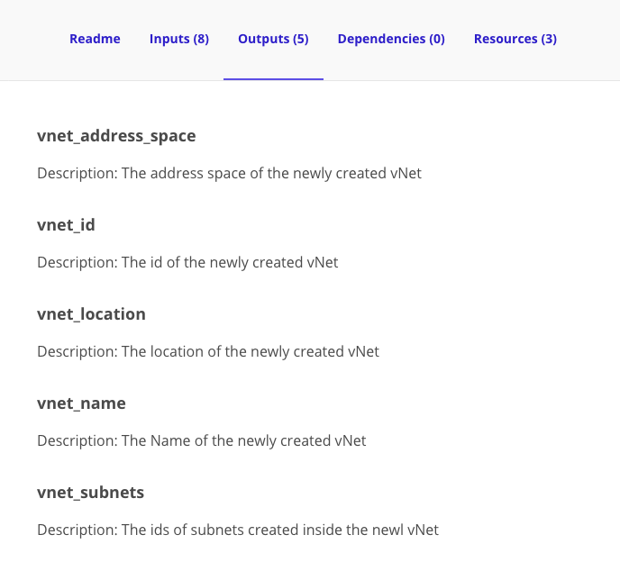

# 06 - Public Module Registry

## Expected Outcome

In this challenge, you will take a look at the public [Module Registry](https://registry.terraform.io/) and create a Virtual Machine from verified  Public Modules.

## How to

### Navigate the Public Module Registry

Open your browser and navigate to the [Module Registry](https://registry.terraform.io/). 

Search for "Compute" which will yield all compute resources in the registry.

Now Filter By 'azurerm' which should give you (among others) the Microsoft Azure Compute Module.

If you are having issues locating the module, you can find it directly at [https://registry.terraform.io/modules/Azure/compute/azurerm/1.1.5](https://registry.terraform.io/modules/Azure/compute/azurerm/1.1.5).

Search again for "Networking" and apply the same Filter By, which should give you the Microsoft Azure Networking Module.

If you are having issues locating the module, you can find it directly at [https://registry.terraform.io/modules/Azure/network/azurerm/2.0.0](https://registry.terraform.io/modules/Azure/network/azurerm/2.0.0).

### Create Terraform Configuration

From the Cloud Shell, change directory into a folder specific to this challenge. If you created the scaffolding in Challenge 00, then then you can use the command `cd ~/clouddrive/AzureWorkChallenges/challenge06/`.

To create an Azure Virtual Machine we need the networking in place, to do so we will be using both the modules above.
The Networking module will create the Virtual Network and Subnet, then the Compute module will use that subnet as an input to create its Virtual Machine.

Create a `main.tf` file in this directory and add the networking module.

The following will configure the module to create a single Virtual Network and a Subnet.

```hcl
module "network" {
  source              = "Azure/network/azurerm"
  version             = "2.0.0"
  resource_group_name = "myapp-networking"
  location            = "eastus"

  tags = {
    environment = "dev"
  }
}
```

Run a `terraform init` and `terraform plan` to verify that all the resources look correct.

<details><summary>View Output</summary>
<p>

```sh
An execution plan has been generated and is shown below.
Resource actions are indicated with the following symbols:
  + create

Terraform will perform the following actions:

  + module.network.azurerm_resource_group.network
      id:                   <computed>
      location:             "eastus"
      name:                 "myapp-networking"
      tags.%:               <computed>

  + module.network.azurerm_subnet.subnet
      id:                   <computed>
      address_prefix:       "10.0.1.0/24"
      ip_configurations.#:  <computed>
      name:                 "subnet1"
      resource_group_name:  "myapp-networking"
      virtual_network_name: "acctvnet"

  + module.network.azurerm_virtual_network.vnet
      id:                   <computed>
      address_space.#:      "1"
      address_space.0:      "10.0.0.0/16"
      location:             "eastus"
      name:                 "acctvnet"
      resource_group_name:  "myapp-networking"
      subnet.#:             <computed>
      tags.%:               "1"
      tags.environment:     "dev"


Plan: 3 to add, 0 to change, 0 to destroy.
```

</p>
</details>

Run `terraform apply` to create the infrastructure.

### View Outputs

The Public Registry contains a lot of information about the module. Navigate to the outputs tab for the [Networking Module](https://registry.terraform.io/modules/Azure/network/azurerm/2.0.0?tab=outputs).

We can see the outputs we should expect and a short description of each of them.



Now that we have the networking infrastructure applied, we can view the outputs with terraform by running `terraform output -module network`.

> Note: Because we are using a module, the outputs are not available at the root module, hence the need to specify the `-module network` option.

```sh
$ terraform output -module network
vnet_address_space = [
    10.0.0.0/16
]
vnet_id = /subscriptions/.../resourceGroups/myapp-networking/providers/Microsoft.Network/virtualNetworks/acctvnet
vnet_location = eastus
vnet_name = acctvnet
vnet_subnets = [
    /subscriptions/.../resourceGroups/myapp-networking/providers/Microsoft.Network/virtualNetworks/acctvnet/subnets/subnet1
]
```

### Add Compute Module - Windows

With Networking in place you can now add the Compute module to create a Windows Virtual Machine.

```hcl
module "windowsservers" {
  source              = "Azure/compute/azurerm"
  version             = "1.1.5"
  resource_group_name = "myapp-compute-windows"
  location            = "eastus"
  admin_password      = "ComplxP@ssw0rd!"
  vm_os_simple        = "WindowsServer"
  nb_public_ip        = 0
  vnet_subnet_id      = "${module.network.vnet_subnets[0]}"
}
```

Run a `terraform init` and `terraform plan` to verify that all the resources look correct.

> Note: Take a minute to analyse why you needed to run another `terraform init` command before you could run a plan.

<details><summary>View Output</summary>
<p>

```sh
An execution plan has been generated and is shown below.
Resource actions are indicated with the following symbols:
  + create

Terraform will perform the following actions:

  + module.windowsservers.azurerm_availability_set.vm
      id:                                                               <computed>
      location:                                                         "eastus"
      managed:                                                          "true"
      name:                                                             "myvm-avset"
      platform_fault_domain_count:                                      "2"
      platform_update_domain_count:                                     "2"
      resource_group_name:                                              "myapp-compute"
      tags.%:                                                           <computed>

  + module.windowsservers.azurerm_network_interface.vm
      id:                                                               <computed>
      applied_dns_servers.#:                                            <computed>
      dns_servers.#:                                                    <computed>
      enable_ip_forwarding:                                             "false"
      internal_dns_name_label:                                          <computed>
      internal_fqdn:                                                    <computed>
      ip_configuration.#:                                               "1"
      ip_configuration.0.load_balancer_backend_address_pools_ids.#:     <computed>
      ip_configuration.0.load_balancer_inbound_nat_rules_ids.#:         <computed>
      ip_configuration.0.name:                                          "ipconfig0"
      ip_configuration.0.primary:                                       <computed>
      ip_configuration.0.private_ip_address:                            <computed>
      ip_configuration.0.private_ip_address_allocation:                 "dynamic"
      ip_configuration.0.public_ip_address_id:                          "${length(azurerm_public_ip.vm.*.id) > 0 ? element(concat(azurerm_public_ip.vm.*.id, list(\"\")), count.index) : \"\"}"
      ip_configuration.0.subnet_id:                                     "/subscriptions/27e9ff76-ce7b-4176-b2bb-4d3f40e1c999/resourceGroups/myapp-networking/providers/Microsoft.Network/virtualNetworks/acctvnet/subnets/subnet1"
      location:                                                         "eastus"
      mac_address:                                                      <computed>
      name:                                                             "nic-myvm-0"
      network_security_group_id:                                        "${azurerm_network_security_group.vm.id}"
      private_ip_address:                                               <computed>
      private_ip_addresses.#:                                           <computed>
      resource_group_name:                                              "myapp-compute"
      tags.%:                                                           <computed>
      virtual_machine_id:                                               <computed>

  + module.windowsservers.azurerm_network_security_group.vm
      id:                                                               <computed>
      location:                                                         "eastus"
      name:                                                             "myvm-3389-nsg"
      resource_group_name:                                              "myapp-compute"
      security_rule.#:                                                  "1"
      security_rule.0.access:                                           "Allow"
      security_rule.0.description:                                      "Allow remote protocol in from all locations"
      security_rule.0.destination_address_prefix:                       "*"
      security_rule.0.destination_port_range:                           "3389"
      security_rule.0.direction:                                        "Inbound"
      security_rule.0.name:                                             "allow_remote_3389_in_all"
      security_rule.0.priority:                                         "100"
      security_rule.0.protocol:                                         "tcp"
      security_rule.0.source_address_prefix:                            "*"
      security_rule.0.source_port_range:                                "*"
      tags.%:                                                           <computed>

  + module.windowsservers.azurerm_public_ip.vm
      id:                                                               <computed>
      domain_name_label:                                                "winsimplevmips"
      fqdn:                                                             <computed>
      ip_address:                                                       <computed>
      location:                                                         "eastus"
      name:                                                             "myvm-0-publicIP"
      public_ip_address_allocation:                                     "dynamic"
      resource_group_name:                                              "myapp-compute"
      tags.%:                                                           <computed>

  + module.windowsservers.azurerm_resource_group.vm
      id:                                                               <computed>
      location:                                                         "eastus"
      name:                                                             "myapp-compute"
      tags.%:                                                           "1"
      tags.source:                                                      "terraform"

  + module.windowsservers.azurerm_virtual_machine.vm-windows
      id:                                                               <computed>
      availability_set_id:                                              "${azurerm_availability_set.vm.id}"
      boot_diagnostics.#:                                               "1"
      boot_diagnostics.0.enabled:                                       "false"
      delete_data_disks_on_termination:                                 "false"
      delete_os_disk_on_termination:                                    "false"
      location:                                                         "eastus"
      name:                                                             "myvm0"
      network_interface_ids.#:                                          <computed>
      os_profile.#:                                                     "1"
      os_profile.249456377.admin_password:                              <sensitive>
      os_profile.249456377.admin_username:                              "azureuser"
      os_profile.249456377.computer_name:                               "myvm0"
      os_profile.249456377.custom_data:                                 <computed>
      os_profile_windows_config.#:                                      "1"
      os_profile_windows_config.429474957.additional_unattend_config.#: "0"
      os_profile_windows_config.429474957.enable_automatic_upgrades:    "false"
      os_profile_windows_config.429474957.provision_vm_agent:           "false"
      os_profile_windows_config.429474957.winrm.#:                      "0"
      resource_group_name:                                              "myapp-compute"
      storage_image_reference.#:                                        "1"
      storage_image_reference.3904372903.id:                            ""
      storage_image_reference.3904372903.offer:                         "WindowsServer"
      storage_image_reference.3904372903.publisher:                     "MicrosoftWindowsServer"
      storage_image_reference.3904372903.sku:                           "2016-Datacenter"
      storage_image_reference.3904372903.version:                       "latest"
      storage_os_disk.#:                                                "1"
      storage_os_disk.0.caching:                                        "ReadWrite"
      storage_os_disk.0.create_option:                                  "FromImage"
      storage_os_disk.0.disk_size_gb:                                   <computed>
      storage_os_disk.0.managed_disk_id:                                <computed>
      storage_os_disk.0.managed_disk_type:                              "Premium_LRS"
      storage_os_disk.0.name:                                           "osdisk-myvm-0"
      tags.%:                                                           "1"
      tags.source:                                                      "terraform"
      vm_size:                                                          "Standard_DS1_V2"

  + module.windowsservers.random_id.vm-sa
      id:                                                               <computed>
      b64:                                                              <computed>
      b64_std:                                                          <computed>
      b64_url:                                                          <computed>
      byte_length:                                                      "6"
      dec:                                                              <computed>
      hex:                                                              <computed>
      keepers.%:                                                        "1"
      keepers.vm_hostname:                                              "myvm"


Plan: 7 to add, 0 to change, 0 to destroy.
```

</p>
</details>

Before applying, take a look at all the resources that are going to be created from our simple `module` block.

Run `terraform apply` to create the infrastructure.

### Clean up

Run `terraform destroy` to remove everything we created.

## Advanced areas to explore

1. Add a public ip to the Windows Compute instance using additional parameters built into the Compute module.
1. Create a second module instance of Compute to stand up a Linux Virtual Machine.

## Resources

- [Azurerm Networking Moduel Source](https://github.com/Azure/terraform-azurerm-network)
- [Azurerm Compute Module Source](https://github.com/Azure/terraform-azurerm-compute)
- [Network Security Groups](https://docs.microsoft.com/en-us/azure/virtual-network/virtual-networks-nsg)
