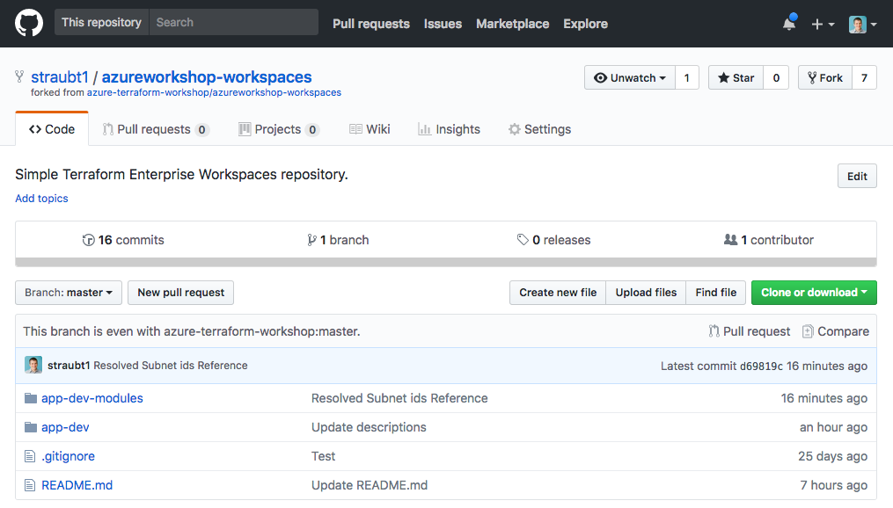
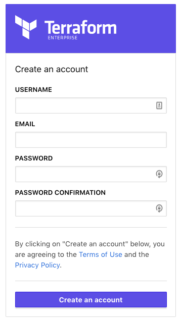
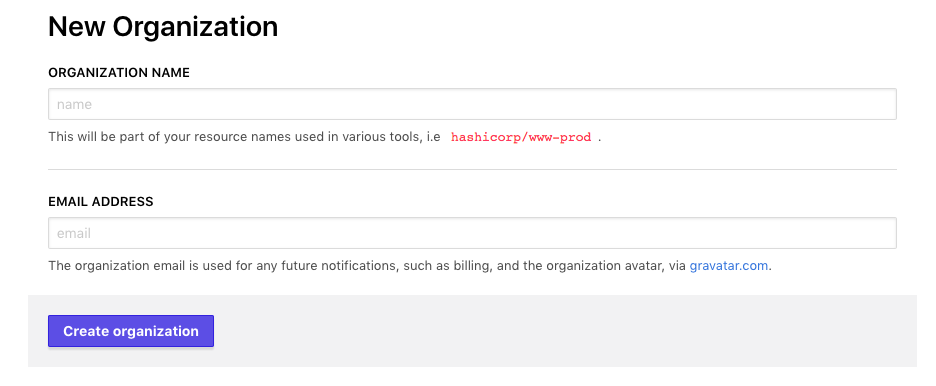
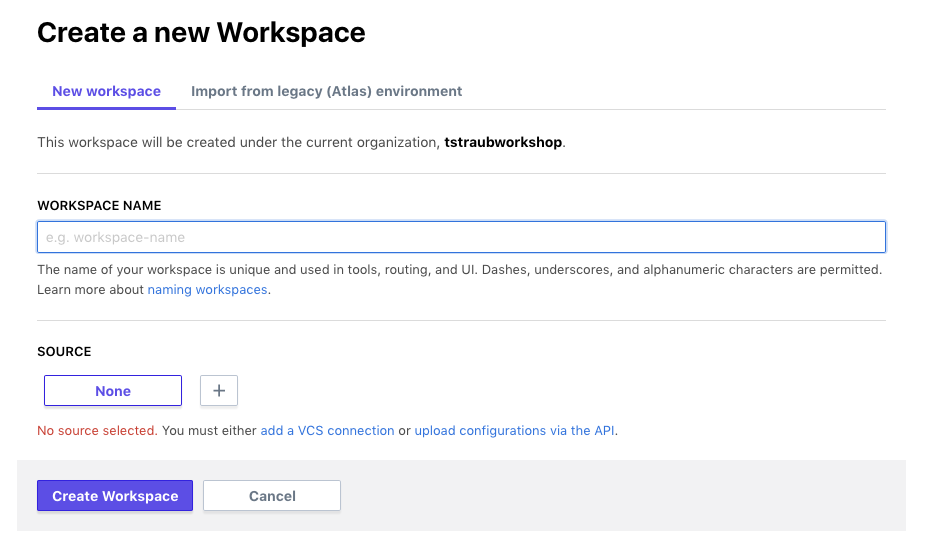
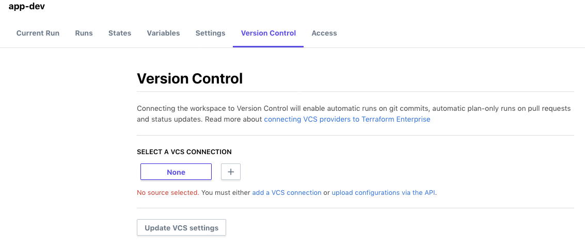
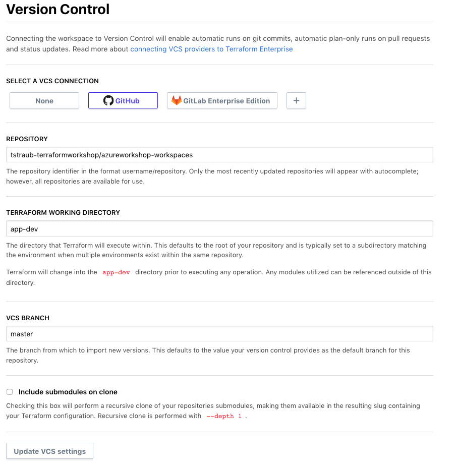
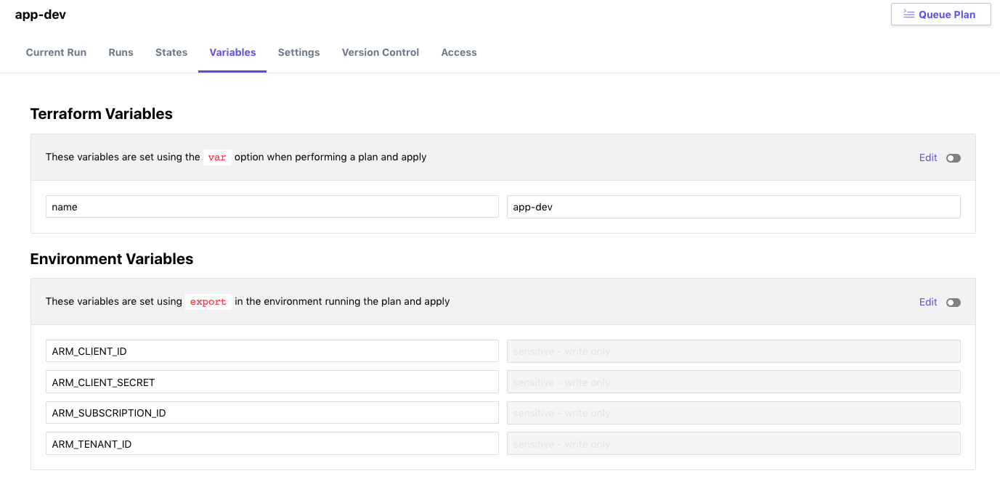
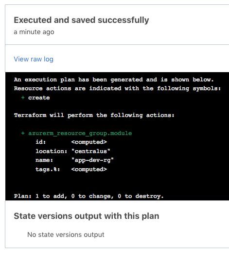
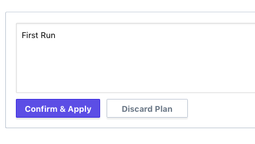

# 08 - Setup Terraform Enterprise

## Expected Outcome

In this challenge, you will create your Terraform Enterprise trial and your first workspace to build infrastructure in Azure.

This challenge will require that you have a github account so that you can fork repositories. Be sure to login before beginning.

## How to

### Fork the Repository

Open up a browser and navigate to the pre-built repository https://github.com/azure-terraform-workshop/azureworkshop-workspaces.

In the top right, click the `Fork` button.

Follow the prompts which will fork the repository into your own space you control.

> Note: We need to fork this repository to allow you to connect it to Terraform Enterprise which will create webhooks to get vital information about how and when the repository changes.

You should land in your forked version of the repository.

### azureworkshop-workspaces repository

There is not much to this repository, just a couple folders that we will use in the next few challenges.

**app-dev** - Simple set of infrastructure to deploy from Terraform Enterprise.

**app-dev-modules** - More complex set infrastructure utilizing the Private Module Registry. Ignore this for now, we will use this in the next Challenge.

### Create a Trial Account for Terraform Enterprise

Register for a [Terraform Enterprise Trial](https://app.terraform.io/account/new?trial=terraform).

If you are working on this today with others from your organization, you can create a single trial and work together through the last few challenges.

### Create a New Organization

Pick a name that includes your name. Example: 'tstraubworkshop'

> __Note:__ Organization must be globally unique.

Verify you can login to your Terraform Enterprise organization.

Now you are ready to start using Terraform Enterprise!

### Create a New Workspace

Click the "New Workspace" button.

Pick a name that indicates the intent of the infrastructure. Example: 'app-dev'

### Setup VCS

You won't have any "Source" options, so click the "+" button to connect Terraform Enterprise to your source control.

Follow the instructions for any of the following VSC providers (we are going to be using Github):

- [Github](https://www.terraform.io/docs/enterprise/vcs/github.html)
- [Github Enterprise](https://www.terraform.io/docs/enterprise/vcs/github-enterprise.html)
- [GitLab](https://www.terraform.io/docs/enterprise/vcs/gitlab-com.html)
- [GitLab EE and CE](https://www.terraform.io/docs/enterprise/vcs/gitlab-eece.html)
- [Bitbucket Cloud](https://www.terraform.io/docs/enterprise/vcs/bitbucket-cloud.html)
- [Bitbucket Server](https://www.terraform.io/docs/enterprise-legacy/index.html)

> Note: This only has to be done once for each Version Control Provider.

### Connect Workspace

Connect your workspace to your VCS.

Set working directory and branch properly!

### Configure Variables

Now that you have a workspace, navigate to the variables.

Set a the Terraform Variable "name" to something unique. Example "app-dev". Click "Save".

Set Environment Variables for your Azure Service Principal (be sure check the 'sensitive' checkbox to hide these values):

- ARM_TENANT_ID
- ARM_SUBSCRIPTION_ID
- ARM_CLIENT_ID
- ARM_CLIENT_SECRET

Click "Save".

### Run a Plan

Click the "Queue Plan" button.

### View the Plan

### Run an Apply

Enter a comment and then Apply.

### View the Apply

## Advanced areas to explore

1. Explore state versions after the apply.
1. Add another folder in the repository for 'app-prod' and create another workspace with different settings.
1. Push a change to the repository with the workspaces in it, what happens in Terraform Enterprise?

## Resources

- [TFE Access](https://www.terraform.io/docs/enterprise/getting-started/access.html)
