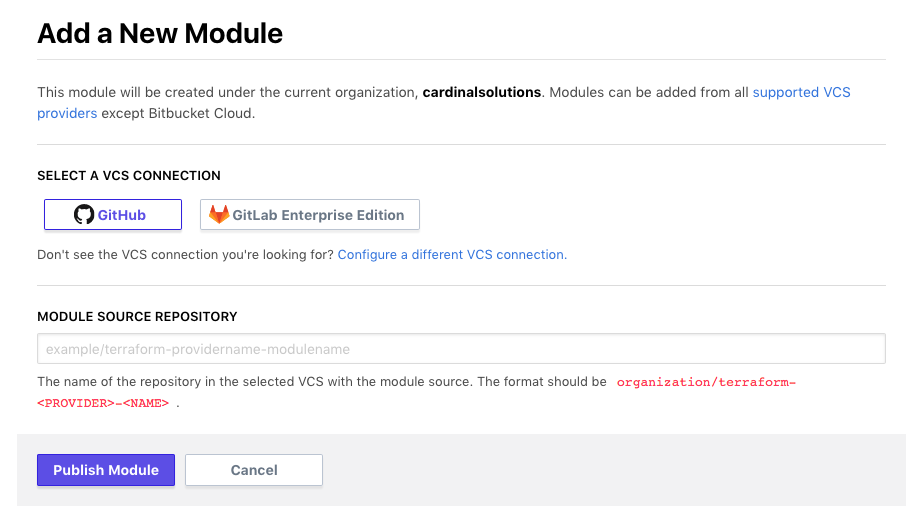
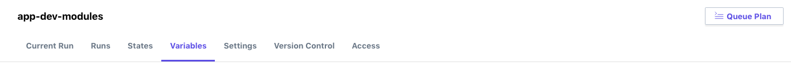

# 09 - Private Module Registry with Terraform Enterprise

## Expected Outcome

In this challenge, you will sync your modules to TFE for consumption.

## How to

### Fork the Module Repositories

Fork the following repo's into your own github account:

- https://github.com/tstraub-terraformworkshop/terraform-azurerm-networking.git
- https://github.com/tstraub-terraformworkshop/terraform-azurerm-webserver.git
- https://github.com/tstraub-terraformworkshop/terraform-azurerm-appserver.git
- https://github.com/tstraub-terraformworkshop/terraform-azurerm-dataserver.git

### Add Modules

Click the "+ Modules" button.



Enter the name of the source repository you forked in the previous step. For example: 'YOUR_GITHUB_USERNAME/terraform-azurerm-networking`.

Click "Publish Module". 
This will query the repository for necessary files and tags used for versioning.

### Consume Modules

Create a new workspace just like in the previous Challenge, except this time select the working directory of "app-dev-module" that will reference your the modules you just added.

### Configure Variables

Set a the Terraform Variables:

- 'name' - A unique environment name such as `devmodules`
- 'location' - An Azure region such as `eastus` or `centralus`
- 'username' (sensitive) - A username for the VM's
- 'password' (sensitive) - A password for the VM's
- 'vnet_address_spacing' (HCL) - The Vnet Address space
    ```hcl
    ["10.0.0.0/16"]
    ```
- 'subnet_address_prefixes' (HCL ) - The Subnet Address spaces representing 3 subnets
    ```hcl
    [
    "10.0.0.0/24",
    "10.0.1.0/24",
    "10.0.2.0/24",
    ]
    ```

Set Environment Variables for your Azure Service Prinipal (be sure check the 'sensative' checkbox to hide these values):

- ARM_TENANT_ID
- ARM_SUBSCRIPTION_ID
- ARM_CLIENT_ID
- ARM_CLIENT_SECRET

### Run a Plan

Click the "Queue Plan" button.



Wait for the Plan to complete.

### Fix the Errors

The `app-dev-modules/main.tf` file references the wrong modules source. Update all the modules sources to match your Terraform Enterprise Organization.

For example.

Change this:

```hcl
module "networking" {
  source  = "app.terraform.io/cardinalsolutions/networking/azurerm"
  version = "0.0.1"
...
}
```

To something like this:
```hcl
module "networking" {
  source  = "app.terraform.io/YOUR_TFE_ORGANIZATION/networking/azurerm"
  version = "0.0.1"
...
}
```

Queue a new Plan.

### Apply the Plan

Approve the plan and apply it.

Watch the apply progress and complete.

Login to the at Azure Portal to see your infrastructure.

### Update a Module

Make a change to the appserver module.

Check in the changet to github.

Add a new version tag: `git tag v0.0.1`

Push the tag to the remote: `git push origin --tags`

View the new module version in Terraform Enterprise.

## Advanced areas to explore

1. Add another module.
1. Add another workspace.

## Resources

- [Private Registries](https://www.terraform.io/docs/registry/private.html)
- [Publishing Modules](https://www.terraform.io/docs/registry/modules/publish.html)